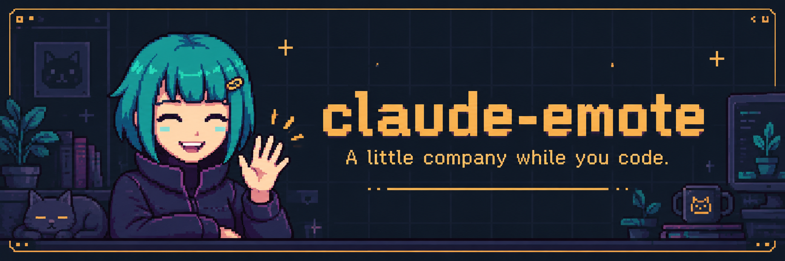
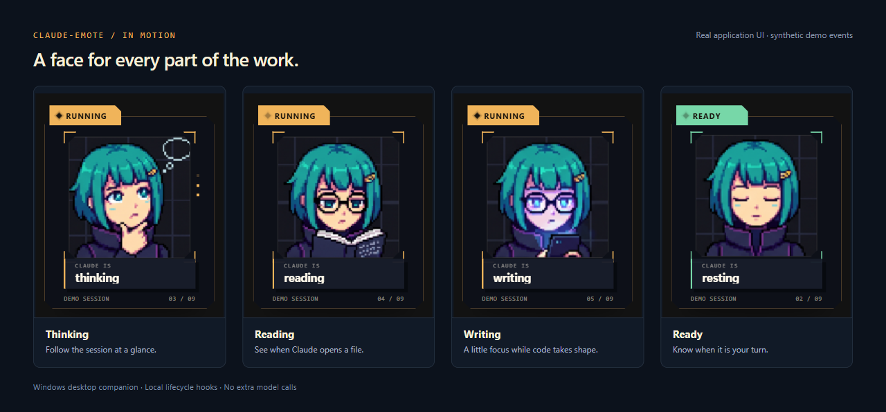
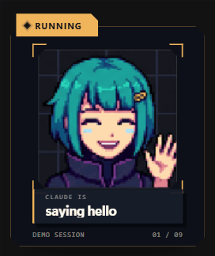

# claude-emote



i wanted my coding agent to have a face. saw pi-emote and wanted that for claude code, so i built this.

she sits next to your terminal and reacts while claude thinks, reads files, writes code, or needs your approval. just a little company while you work. no extra model calls.

using mcode? i made [mcode-emote](https://github.com/K-Jadeja/mcode-emote) for that too.

[Get started](#install-from-this-repository) · [Try the demo](#run-the-desktop-pet-demo) ·
[Validation and roadmap](docs/GITHUB_PUBLICATION.md) · [Development](docs/DEVELOPMENT.md)



<details>
<summary>Watch all nine poses</summary>

<p align="center"></p>

The gallery and animation use the real application UI with synthetic demo events.
The cover is promotional artwork. [Visual sources and reproduction](docs/VISUALS.md).

</details>

## Current release status

This repository contains a Windows beta for Claude Code. It does not integrate
with Codex. The desktop and terminal companions are implemented, but installer,
signing, auto-update, and multi-session management remain unfinished. See
[`docs/GITHUB_PUBLICATION.md`](docs/GITHUB_PUBLICATION.md) for current test
evidence and the checks still needed before a stable release. The source is public; this remains a beta.

The CLI command remains `claude-emote`. Its bundled third-party plugin is named
`emote-companion` to satisfy current Claude Code plugin-name validation.

`claude-emote` turns Claude Code lifecycle hooks into a small, expressive pet
that shows when a session is thinking, reading, writing, using tools, waiting
for permission, finished, or blocked. It does not read terminal text and does
not make another model call.

The project has two supported renderers:

- a terminal renderer that runs beside Claude Code in
  Windows Terminal;
- a transparent desktop overlay built with Neutralinojs and the operating
  system WebView.

On Windows, the desktop pet is the default. The launcher starts and supervises
the host, overlay, bundled Claude plugin, and real Claude Code process.

## Why this architecture

[Claude Code lifecycle hooks](https://code.claude.com/docs/en/hooks-guide)
cover session start, prompts, tool use, permissions, compaction, completion,
and session end. Those events are a better source of truth than terminal
scraping: they are structured, session-aware, and do not require guessing what
Claude is doing.

The pet receives only five semantic fields:

```ts
{
  sessionId: string;
  sequence: number;
  status: "running" | "needs-input" | "ready" | "blocked" | "ended" | "disconnected";
  activity: "greeting" | "idle" | "thinking" | "reading" | "writing" | "tooling" | "talking" | "compacting" | "failure";
  timestamp: number;
}
```

Prompts, assistant output, tool arguments, tool results, project paths, and
credentials are excluded from the desktop protocol.

Neutralinojs keeps the native distribution small by using the system WebView
instead of bundling Chromium. The current Windows executable plus resources is
about 4 MB before installer packaging or signing. Electron is not required.

## What works now

| Capability | Status |
| --- | --- |
| Claude Code hook plugin | Working |
| Terminal avatar beside Claude | Working |
| Transparent always-on-top desktop pet | Working |
| Desktop demo with every pose | Working |
| Live semantic state snapshot and SSE stream | Working |
| Permission-needed and session-ended states | Working |
| Window dragging and position persistence | Implemented; drag movement needs a fresh manual check |
| Windows display scaling | Tested |
| Short privacy-safe project label | Working |
| Packaged Windows executable | Builds and launches |
| One-command automatic desktop launch | Working on Windows x64 |
| Installer, tray, signing, auto-update | Not implemented |
| Multi-session pet manager | Not implemented |

## Prerequisites

For the current Windows development flow:

- Windows 10 or 11;
- Node.js 20.18.1 or newer, or Node.js 22;
- npm 10 or newer;
- Claude Code installed and available as `claude`;
- Windows Terminal for the terminal side-pane renderer;
- WebView2 for the desktop overlay. It is included with current Windows
  installations;
- optionally, Chafa for image rendering in the terminal. The desktop overlay
  does not need Chafa.

No Electron, Rust, Go, .NET SDK, cloud service, or additional AI API key is
required.

## Install from this repository

```powershell
git clone https://github.com/K-Jadeja/claude-emote.git
cd claude-emote
npm ci
npm run build
npm run overlay:package
```

To make the development checkout's command available globally:

```powershell
npm link
claude-emote --version
```

If you do not want to create a global link, run the launcher directly:

```powershell
node .\bin\claude-emote.cjs --version
```

This repository is currently private in `package.json` and has not been
published to npm. Do not expect `npm install -g claude-emote` from the public
registry to work yet.

## Start Claude with the desktop pet

Run `claude-emote` wherever you would normally run `claude`:

```powershell
claude-emote
claude-emote --resume
claude-emote --model opus
claude-emote --dangerously-skip-permissions
```

All arguments are forwarded to the real Claude Code process. The launcher:

1. verifies that Claude Code is available;
2. allocates a random loopback port and session ID;
3. starts the local avatar host;
4. opens the native desktop pet and waits for its first connected render;
5. waits for authenticated host and overlay health checks;
6. starts Claude with this repository's plugin and session endpoint;
7. forwards Claude's exit code and cleans up the session process.

If the visual process cannot start after its bounded startup checks, Claude
still starts without emote hooks and the launcher prints a clear warning. It
does not silently substitute the terminal renderer.

Renderer choices are launcher-owned flags and are removed before Claude starts:

```powershell
claude-emote --emote-renderer=desktop --resume
claude-emote --emote-renderer=terminal --resume
claude-emote --no-emote --resume
```

Everything after `--` is forwarded literally to Claude, including anything
that resembles an emote flag.

Check an installation without starting Claude:

```powershell
claude-emote --emote-doctor
```

See [`docs/DIAGNOSTICS.md`](docs/DIAGNOSTICS.md) for safe debug output.

## Run the desktop pet demo

The simplest way to see the new native overlay is:

```powershell
npm run overlay:run
```

The first run downloads the pinned Neutralino native runtime, builds the local
web resources, and opens the transparent desktop window. It cycles through
every pose using synthetic semantic state and is visibly labelled as a demo.
It does not start Claude.

In the overlay:

- drag the body to reposition it;
- hover to reveal controls;
- use pause or next to inspect an animation;
- close it with its close control or stop the command with `Ctrl+C`;
- reopen it to verify that its last desktop position was retained.

Build a distributable package with:

```powershell
npm run overlay:package
```

Generated packages are written under `desktop/dist/` and are intentionally not
tracked by Git.

## Run a live desktop development session

Build or package the overlay once, link the checkout, then use the real command:

```powershell
npm run overlay:package
npm link
claude-emote --resume
```

The authenticated manual protocol is documented in
[`docs/DESKTOP_SESSION_PROTOCOL.md`](docs/DESKTOP_SESSION_PROTOCOL.md) for
contributors writing protocol tests. End users never copy endpoints or tokens.

## One-command user flow

The implemented process tree is:

```text
claude-emote [normal Claude arguments]
    |
    +-- starts one local session host
    +-- starts one desktop pet connected to that host
    +-- starts Claude Code with the bundled hook plugin
    +-- supervises shutdown and forwards Claude's exit code
```

For the user, the workflow remains:

```powershell
claude-emote --resume
```

The expected experience is:

1. The pet wakes while Claude starts.
2. The pet changes pose from real Claude lifecycle events.
3. A strong attention state appears when permission or input is required.
4. Closing Claude ends the session and lets the pet rest briefly before
   closing.
5. Starting another `claude-emote` session creates another identified pet.
6. A later tray or "nest" UI can group multiple sessions without changing the
   hook or semantic-state contracts.

See [`docs/USER_FLOW.md`](docs/USER_FLOW.md) for the product flow, failure
behavior, and the reasons this is preferable to terminal scraping, MCP calls,
or wrapping the Claude Agent SDK.

## How events become animation

```text
Claude Code
    |
    | plugin command hook, JSON on stdin
    v
hook bridge
    |
    | POST /event on 127.0.0.1
    v
per-session Node host
    |
    +-- validates the hook payload
    +-- maps it to a semantic activity
    +-- updates the terminal animation engine
    +-- publishes a privacy-minimal snapshot and SSE event
    |
    v
desktop overlay
    |
    +-- validates the five-field state
    +-- ignores stale sequence numbers
    +-- selects local animation frames
    +-- reconnects through an authoritative snapshot
```

The command hook exits successfully and never controls Claude's permissions or
model behavior. The pet observes session lifecycle; it does not modify it.

Detailed references:

- [`docs/ARCHITECTURE.md`](docs/ARCHITECTURE.md) - existing host and terminal
  architecture;
- [`docs/DESKTOP_OVERLAY_ARCHITECTURE.md`](docs/DESKTOP_OVERLAY_ARCHITECTURE.md)
  - desktop shell decision and boundaries;
- [`docs/DESKTOP_SESSION_PROTOCOL.md`](docs/DESKTOP_SESSION_PROTOCOL.md) -
  desktop wire protocol and privacy contract;
- [`docs/STATE_MACHINE.md`](docs/STATE_MACHINE.md) - hook-to-animation rules;
- [`docs/SOURCE_MAP.md`](docs/SOURCE_MAP.md) - source ownership and provenance;
- [`docs/PRODUCT_VISION.md`](docs/PRODUCT_VISION.md) - product principles.

## State mapping

Examples of the deterministic mapping:

| Claude event | Pet status | Pet activity |
| --- | --- | --- |
| `SessionStart` | running | greeting |
| `UserPromptSubmit` | running | thinking |
| `PreToolUse` for Read/Glob/Grep | running | reading |
| `PreToolUse` for Edit/Write | running | writing |
| other `PreToolUse` | running | tooling |
| `PermissionRequest` | needs-input | thinking |
| `PreCompact` | running | compacting |
| `Stop` | ready | idle |
| failed tool or stop | blocked | failure |
| `SessionEnd` | ended | idle |

No hidden reasoning tokens are inspected. "Thinking" is a presentation state
derived from public lifecycle events, not chain-of-thought access.

## Configuration

`config.json` retains compatibility with the upstream pi-emote animation
configuration. The launcher also recognizes:

| Variable | Purpose |
| --- | --- |
| `CLAUDE_EMOTE_INSTANCE_ID` | Per-launch ID set by the launcher |
| `CLAUDE_EMOTE_ENDPOINT` | Per-session loopback event URL set by the launcher |
| `CLAUDE_EMOTE_CAPABILITY_TOKEN` | Internal per-session bearer capability; never put in URLs or logs |
| `CLAUDE_EMOTE_PARENT_PID` | Launcher PID used for orphan cleanup |
| `CLAUDE_EMOTE_RENDERER` | Optional `desktop`, `terminal`, or `none` default |
| `CLAUDE_EMOTE_SESSION_LABEL` | Optional desktop label; defaults to the current directory name, limited to 48 visible characters |
| `CLAUDE_EMOTE_HIDE_SESSION_LABEL=1` | Hide desktop session identity entirely |
| `CLAUDE_EMOTE_DEBUG=1` | Verbose diagnostic logging |
| `CLAUDE_EMOTE_CHAFA_PATH` | Explicit `chafa.exe` path |
| `CLAUDE_EMOTE_EMOTE_DIR` | Explicit custom terminal emote directory |
| `CLAUDE_EMOTE_DATA_DIR` | User data directory; defaults to `~/.claude-emote` |
| `CLAUDE_EMOTE_LOG_FILE` | Optional persistent diagnostic log |
| `CLAUDE_EMOTE_VISUAL_PANE=1` | Internal terminal-pane output mode |
| `CLAUDE_EMOTE_WT_EXE` | Explicit Windows Terminal executable override |

Variables described as launcher-owned are internal protocol. End users should
not need to set them in the finished desktop flow.

The default session label contains only the final directory name. For example,
launching from `D:\work\client-a` shows `client-a`; the full path never enters
the desktop protocol, command line, or logs. Set a temporary custom label in
PowerShell before launching:

```powershell
$env:CLAUDE_EMOTE_SESSION_LABEL = "Website redesign"
claude-emote --resume
Remove-Item Env:CLAUDE_EMOTE_SESSION_LABEL
```

To show no project identity:

```powershell
$env:CLAUDE_EMOTE_HIDE_SESSION_LABEL = "1"
claude-emote
Remove-Item Env:CLAUDE_EMOTE_HIDE_SESSION_LABEL
```

## Updating Claude Code and Claude Emote

Claude Code and Claude Emote are intentionally independent installations.
`claude-emote` resolves the real `claude` executable on every launch, so a
normal Claude Code update is picked up the next time the user starts a session.
Claude Emote does not pin, replace, or modify Claude Code.

Update Claude Code using the method that installed it:

```powershell
# Anthropic native installation
claude update

# Windows Package Manager installation
winget upgrade Anthropic.ClaudeCode

# npm installation
npm install -g @anthropic-ai/claude-code@latest
```

Native Claude Code installations can also update automatically in the
background. The update takes effect on the next launch.

During repository development, update Claude Emote separately:

```powershell
git pull
npm ci
npm run build
npm link
```

A published npm release would instead use:

```powershell
npm install -g claude-emote@latest
```

Most additive Claude hook changes are tolerated: extra input fields are
ignored, and unknown future events do not crash the mapper. A removed or renamed
hook event can cause a specific animation to stop updating, so compatibility is
verified and released independently. Claude should still start even if the pet
cannot connect.

If an update produces unexpected behavior, run `Get-Command claude` and
`where.exe claude` to find conflicting installations, confirm `claude
--version`, and update Claude Emote. Users should not have to downgrade or
freeze Claude Code for the pet. The complete policy and release checks are in
[`docs/COMPATIBILITY.md`](docs/COMPATIBILITY.md).

## Custom artwork

The current terminal importer can read PNG and YAML emote sets inherited from
pi-emote. The desktop preview uses 19 existing MIT-attributed PNG frames from
`emotes/default/`.

The desktop asset manifest is `desktop/asset-manifest.json`. A future public
pet-pack contract should include:

- a stable pet ID and display name;
- license and attribution;
- frame dimensions and animation timing;
- mappings for every required activity;
- validation that rejects missing or ambiguous states.

Do not silently substitute a different pose when a required frame is missing.
The build fails instead.

## Development

Common commands:

| Command | Purpose |
| --- | --- |
| `npm run build` | Compile the Node launcher, host, and terminal renderer |
| `npm run typecheck` | Type-check Node source |
| `npm run overlay:typecheck` | Type-check desktop source |
| `npm run test:unit` | Run small-scope tests |
| `npm run test:integration` | Run process and HTTP boundary tests |
| `npm test` | Build and run the complete suite |
| `npm run demo` | Run every terminal animation state |
| `npm run overlay:run` | Build and launch the native desktop demo |
| `npm run overlay:package` | Build native packages |
| `npm run verify:upstream` | Confirm the vendored upstream snapshot is unchanged |
| `npm run validate:plugin` | Validate the Claude Code plugin manifest |
| `npm run validate:package` | Pack and smoke-test the npm package |
| `npm run audit:runtime` | Audit production dependencies only |

See [`docs/DEVELOPMENT.md`](docs/DEVELOPMENT.md) for the contributor workflow
and recurring troubleshooting procedures.

The latency benchmark and its limits are recorded in
[`docs/BENCHMARK_RESULTS.md`](docs/BENCHMARK_RESULTS.md). On the recorded test
machine, the full command-hook bridge to terminal-frame path had a 77.88 ms p50
and 93.53 ms p95. Those figures stop at avatar stdout and are not universal
Claude or display-latency claims.

## Troubleshooting

### `claude-emote` is not recognized

Run `npm link` from the repository, or invoke:

```powershell
node .\bin\claude-emote.cjs
```

### Claude Code is not found

Confirm the real command resolves:

```powershell
Get-Command claude
```

Install or repair Claude Code before retrying.

### The terminal avatar pane does not appear

Select terminal mode and run inside Windows Terminal:

```powershell
claude-emote --emote-renderer=terminal
```

The launcher uses the
`WT_SESSION` environment value to avoid opening a pane in an unrelated terminal
window.

Enable diagnostics when needed:

```powershell
$env:CLAUDE_EMOTE_DEBUG = "1"
claude-emote
```

### The terminal avatar is text-only

The bundled ASCII renderer is the supported automatic fallback when the user
has not explicitly selected custom artwork. Install Chafa or point
`CLAUDE_EMOTE_CHAFA_PATH` at a Sixel-capable `chafa.exe` for terminal images.
The desktop overlay always uses its bundled local PNG frames.

### The desktop overlay does not start

Build the pinned native runtime and package, then retry:

```powershell
npm run overlay:setup
npm run overlay:package
claude-emote
```

If it opens as an opaque rectangle, update WebView2 and confirm that
`modes.window.transparent` remains enabled in
`desktop/neutralino.config.json`.

If the taskbar icon appears but the pet does not, update this checkout and
restart the `claude-emote` session. The launcher must not spawn the native GUI
with hidden-window startup state, and the shell now repairs saved positions
that would place a high-DPI window beyond the display edge. See
[`docs/incidents/2026-07-27-native-pet-window-hidden.md`](docs/incidents/2026-07-27-native-pet-window-hidden.md).

### The desktop overlay says disconnected

In live mode, confirm the per-session avatar host is still running and that the
URL is a loopback HTTP endpoint ending in `/event`, `/state`, or `/stream`.
Remote hosts and unexpected paths are rejected intentionally.

### A process remains after Claude exits

The launcher and avatar host use parent-PID watching and bounded shutdown.
Enable `CLAUDE_EMOTE_DEBUG=1`, reproduce once, and record the process tree and
log before forcing termination. Recurring cleanup failures require an incident
note and an exact regression test.

## Security

- The host binds to `127.0.0.1`, not a network interface.
- The browser-readable protocol allows only loopback origins.
- The desktop schema rejects unknown fields.
- Raw Claude content is not retained or sent to the overlay.
- Production dependencies currently audit with zero known vulnerabilities.
- Build-only Neutralino CLI advisories and the pinned-version rationale are
  documented in [`docs/SECURITY.md`](docs/SECURITY.md).
- A per-session capability token is required before turning the session hosts
  into a generalized background daemon.

## Platform scope

The terminal side-pane launcher is currently Windows Terminal-specific. The
desktop shell is also presently packaged and visually validated on Windows.
The UI and semantic protocol are platform-neutral, but macOS and Linux native
packaging are not yet claimed as supported releases.

## Uninstall a development checkout

```powershell
npm unlink -g claude-emote
```

Then remove the checkout and, if desired, the user data directory:

```powershell
Remove-Item -Recurse -Force $env:USERPROFILE\.claude-emote
```

If you manually installed a Claude Code plugin link, remove only that specific
link from your Claude plugins directory.

## License

MIT. See [`LICENSE`](LICENSE).

The animation engine and current default artwork retain their upstream
MIT attribution in [`THIRD_PARTY_NOTICES.md`](THIRD_PARTY_NOTICES.md). The
vendored source snapshot under `vendor/pi-emote-original/` is immutable.
